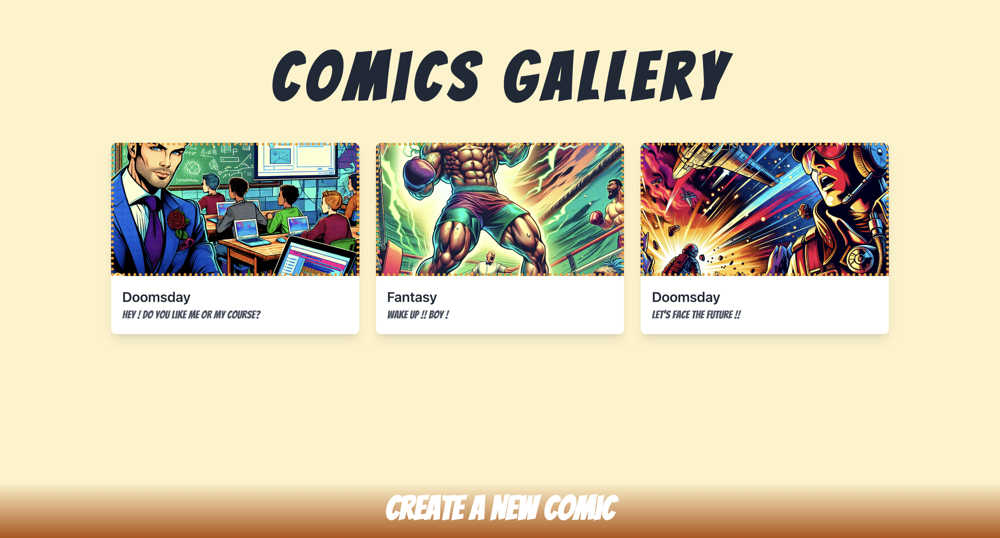

# Cartoonist

Welcome to the **Cartoonist** – a cutting-edge web application that empowers users to unleash their creativity and bring their stories to life in a visually stunning comic format. Designed with a seamless user experience and modern technologies, this platform bridges storytelling and technology to deliver an interactive and intuitive environment for creating, editing, and sharing comics.

---

## Preview

### Home Page


### Editor 


### Showroom


## Features

### 🖋️ **Dynamic Comic Editor**
- Intuitive drag-and-drop interface for positioning and resizing dialog bubbles.
- Real-time editing of dialog text with support for unique comic-style fonts.
- Adjustable bubble sizes and styles to fit various screen sizes (RWD).

### 🎨 **AI-Powered Image Generation**
- Generate custom comic illustrations using **OpenAI's DALL·E 3**.
- Support for multiple styles: Japanese, Western, Fantasy, and Post-Apocalyptic.
- High-resolution image outputs tailored to your story's theme.

### ⚖️ **Robust API Management**
- Centralized API requests using Axios, with unified error handling and loading states.
- Secure and efficient interaction with the backend Laravel API.

### 🏠 **User Gallery**
- Showcase all user-created comics in an engaging, responsive gallery.
- Hover effects and dynamic animations to enhance the user experience.
- Options to view, edit, or create new comics directly from the gallery.

### 🌀 **Cross-Platform Compatibility**
- Fully responsive design for optimal performance across devices, including desktop, tablet, and mobile.
- Interactive animations and effects, ensuring a visually engaging experience.

---

## Tech Stack

### Backend
- **Laravel 10 & Inertia.js**: Powering the robust backend with its elegant syntax and MVC architecture.
- **PHPUnit & Pest**: For writing comprehensive and maintainable tests.

### Frontend
- **React**: Building an interactive and dynamic user interface.
- **Tailwind CSS**: Crafting a modern and responsive design effortlessly.
- **Axios**: Simplifying HTTP requests and managing API interactions.
- **React-Spinners**: Providing visual feedback during loading states.

### AI Integration
- **OpenAI API**: Harnessing the power of DALL·E 3 for generating custom comic visuals.

### Storage
- **AWS S3**: Securely storing generated comic assets.

---

## Installation

### Prerequisites
- **PHP 8.3+**
- **Node.js 18+**
- **Composer**
- **PostgresSQL**

### Steps

1. Clone the repository:
   ```bash
   git clone https://github.com/PhilharmonicHsu/cartoonist.git
   cd cartoonist
   ```

2. Install backend dependencies:
   ```bash
   composer install
   ```

3. Install frontend dependencies:
   ```bash
   npm install
   ```

4. Configure the environment:
    - Copy `.env.example` to `.env`.
    - Update the `.env` file with your database, AWS S3, and OpenAI API credentials.

5. Run database migrations:
   ```bash
   php artisan migrate
   ```

6. Start the development server:
   ```bash
   php artisan serve
   npm run dev
   ```
---

## Usage

1. Access the platform at `http://localhost:8000`.
2. Create a new comic by navigating to the **Create Comic** page.
3. Enter your story summary, character details, and choose a style.
4. Generate visuals with AI and customize them in the editor.
5. Save and share your masterpiece in the user gallery.

---

## Tests

Run the following commands to execute the test suite:

1. Backend tests (PHPUnit/Pest):
   ```bash
   php artisan test
   ```

---

## Contribution

We welcome contributions! Please fork the repository, make your changes, and submit a pull request. Be sure to follow the project's coding standards and test your code thoroughly.

---

## Contact

For questions or feedback, please reach out to us at `xuyuwei19940909@gmail.com`.

Let your creativity shine! ✨

